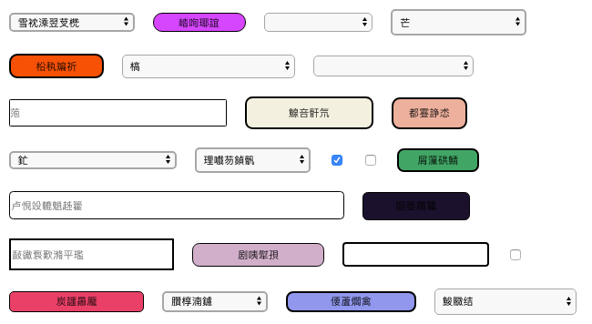
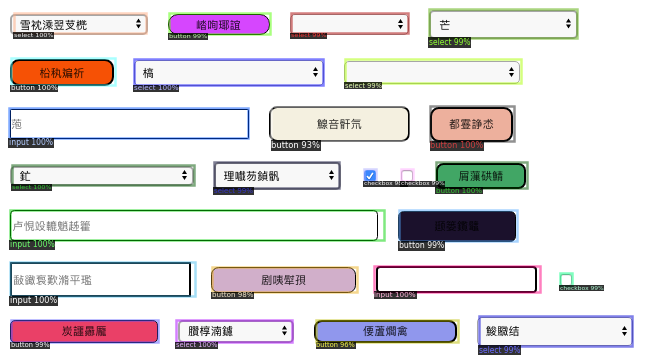

# HTML COCO dataset generate

自动生成HTML常用元素表单的目标检测样本数据集。

机器学习的最重要的是数据集的收集和处理，HTML元素如果采用人工标注来收集处理，会浪费大量人力与时间。因此写了这个项目来自动生成HTML样本数据集。

自动生成图片，每张图上包括25个 HTML 元素，相应的标注都在 json中。

react 项目负责生成网页
puppeteer 截图并生成标注信息

## 样例

## script

build :  `npm run build`

start : `npm run start`

generate : `npm run generate`

## 目录

图片目录：`/pic`

训练json文件 : `/pic/train.json`

测试json文件 : `/pic/test.json`

## 已经生成好的dataset

pic.zip 3.9M
>https://drive.google.com/uc?export=download&id=1XRBS9hxK4l1zMQuMNZuefa12r52yKwX2

50张 train 图
10张 test 图

## colab 训练notebook
>https://github.com/yuxizhe/HTML-COCO-datasets-generate/blob/master/detectron2_html.ipynb

## 使用 Detectron2 训练后示意

